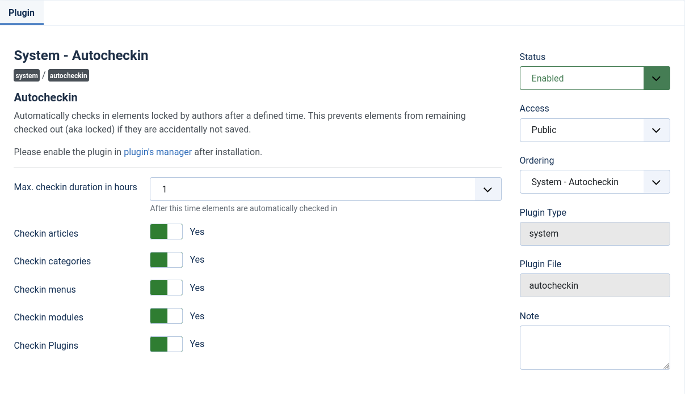

# Joomla Plugin Autocheckin
If you have multiple users working on your Joomla! site, you know the problem:
An item is checked out by another user, that user is not online anymore,
because he has closed his browser window instead of logging out, his session has expired or the browser crashed.

This plugin solves the problem by automatically check-in elements after a specified time.

The following elements can be configured to be checked-in again automatically:
 - articles
 - categories
 - menus
 - modules
 - plugins

## Compatibility
This plugin is tested on **Joomla! 3.10** and **4.0**.
In general it should be compatible since **Joomla! 3.1**

## Plugin settings

## Credits
- Base functionality derived from: https://extensions.joomla.org/extension/autocheckin/